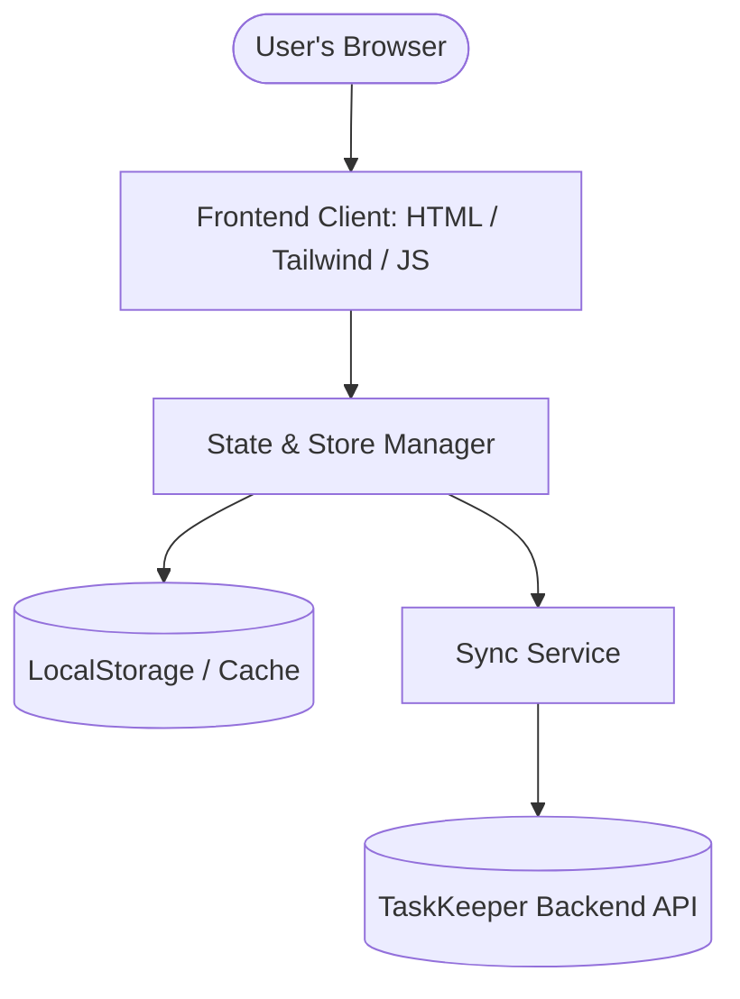

# 🏗️ Architecture & System Design

This document details the architecture, component interaction, and data models of TaskKeeper.

---

## 🗺️ High-Level System Architecture

*Describe the system tiers, tech stack, and external dependencies. A Mermaid diagram is included below to visualize the core architecture.*



---

## 📦 Component breakdown

### 1. Presentation Layer (UI)
-   **Task List Component**: Renders tasks sorted by priority/date.
-   **Keyboard Controller**: Intercepts keyboard events and routes them to actions.
-   **Sidebar / Project Selector**: Switch between different task lists.

### 2. State & Business Logic Layer
-   **Task Store**: Centralized client-side state. Handles creation, status updates, tags, and filtering logic.
-   **Auth Store**: Manages session state and authentication headers.

### 3. Data & Sync Layer
-   **Local Sync Manager**: Persists state changes immediately to local storage.
-   **Remote Sync Agent**: Queues changes and pushes them asynchronously to the server API.

---

## 🗄️ Data Models

### Task Entity
```typescript
interface Task {
  id: string;          // UUID v4
  title: string;       // Task description
  description?: string; // Optional detailed notes
  status: 'todo' | 'in-progress' | 'done';
  priority: 'low' | 'medium' | 'high';
  tags: string[];      // Categorization tags
  createdAt: string;   // ISO-8601 Timestamp
  updatedAt: string;   // ISO-8601 Timestamp
  completedAt?: string; // ISO-8601 Timestamp when completed
}
```

---

## ⚡ Architectural Decisions
All significant architectural decisions are tracked via ADRs (Architectural Decision Records).
See the **[Architecture Decision Log](file:///c:/Users/jason/Documents/Code/TaskKeeper/docs/architecture/decisions/README.md)**.
